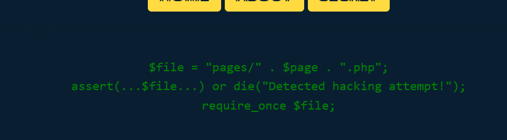
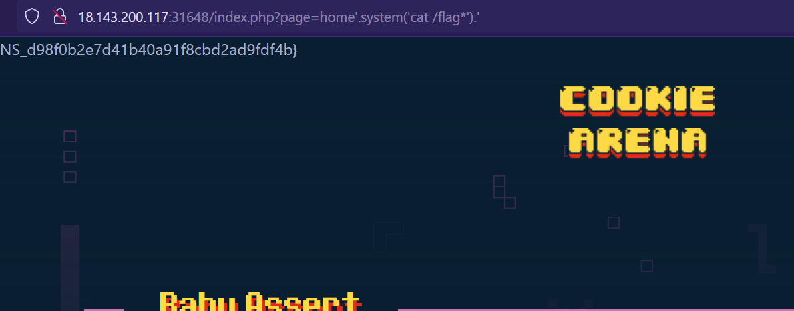

Link challenge:
https://battle.cookiearena.org/challenges/web/baby-assert

Đề gợi ý liên quan đến hàm assert(), sau khi research thì mình được biết nếu truyền một string vào assert() thì nó sẽ hoạt động giống như hàm eval() và Hàm eval() thực thi đoạn mã từ một chuỗi

Exploit:

Tham khảo: https://www.excelinfosec.com/2023/04/how-to-exploit-php-assert-function.html
