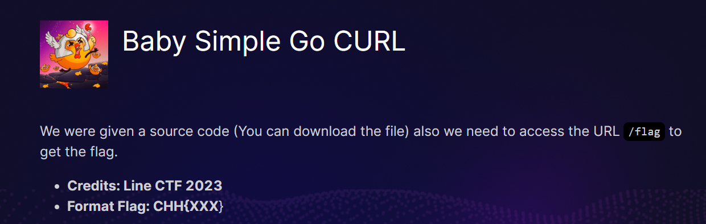
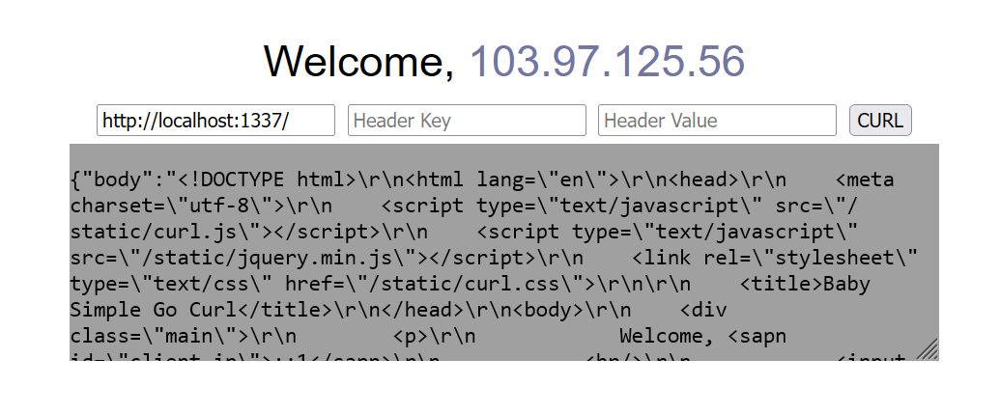
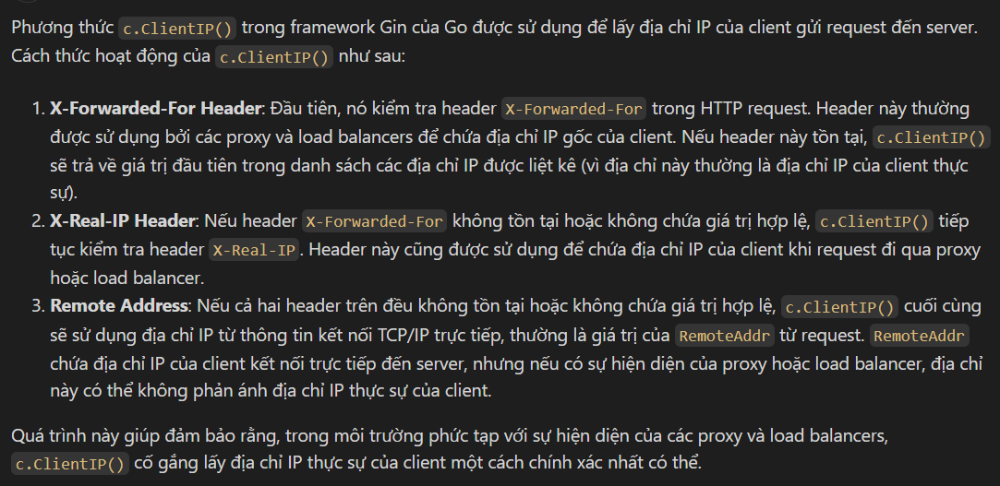
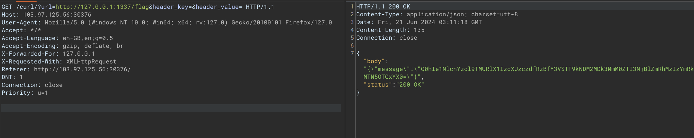

# Baby Simple Go CURL





Bài thuộc dạng ssrf bypass
Đọc source thì chúng ta thấy đoạn code sử dụng c.ClientIP()

```go
if c.ClientIP() != "127.0.0.1" && (strings.Contains(reqUrl, "flag") || strings.Contains(reqUrl, "curl") || strings.Contains(reqUrl, "%")) {
			c.JSON(http.StatusBadRequest, gin.H{"message": "Something wrong"})
			return
		}
```
Sau đó ta research một số thông tin về hàm này



Đồng thời điều kiện ở đoạn code trên có sự xung đột, nếu ip là 127.0.0.1 và có chưa flag thì điều kiện sai nên ta có thể bypass được đoạn trên

```go
r.GET("/flag/", func(c *gin.Context) {
		reqIP := strings.Split(c.Request.RemoteAddr, ":")[0]

		log.Println("[+] IP : " + reqIP)
		if reqIP == "127.0.0.1" {
			c.JSON(http.StatusOK, gin.H{
				"message": flag,
			})
			return
		}

		c.JSON(http.StatusBadRequest, gin.H{
			"message": "You are a Guest, This is only for Host",
		})
	})

```
Ở đoạn này thì chương trình sử dụng `c.Request.RemoteAddr`

Tương tự như trên đoạn này cũng sử dụng `X-Forwarded-For` để lấy ip nếu có

Nên ở đây đơn giản là ta sẽ bypass bằng cách này



Flag: `CHH{Serv3r_S1De_R3qu3s7_G0_cuRL_d4360972c4e2760efda323bdd139941a}`