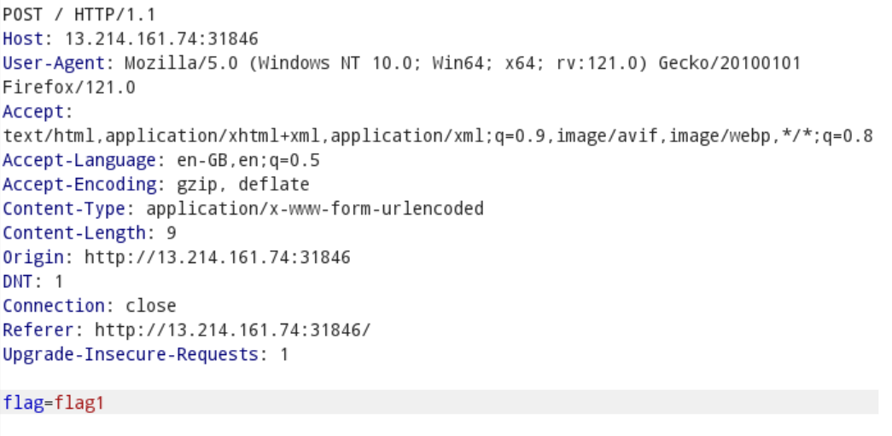
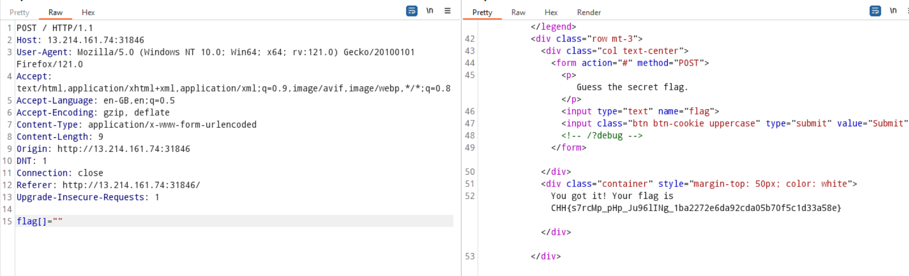

Link challenges: https://battle.cookiearena.org/challenges/web/baby-strcmp

Sau khi reaserch một hồi thì mình hiểu là chương trình sẽ sử dụng hàm strcmp() để so sánh biến flag do mình nhập vào với tên biến flag của server. Chắc chắn cái này ai thần mới nghĩ ra nên mình nghĩ sẽ có cách bypass strcmp().

Ở đây chương trình có nhận một post request là flag, giải sử giờ mình nhập vào rỗng thì $\_POST['flag'] = NULL, mà NULL == 0 trong php. Do đó `strcmp(0, 'foo') => 1`

Research:

https://www.doyler.net/security-not-included/bypassing-php-strcmp-abctf2016

https://www.php.net/manual/en/function.strcmp.php
