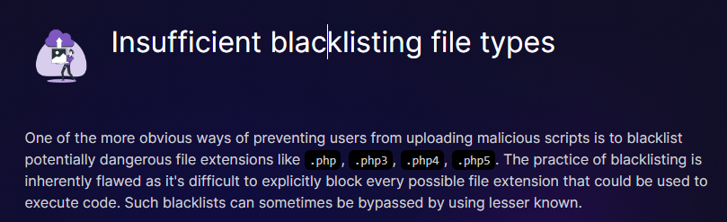

# Insufficient blacklisting file types
Link: https://battle.cookiearena.org/challenges/web/insufficient-blacklisting-file-types



Bài này là dạng upload file, nhưng bị filter các đuôi

Vì mình cũng vừa làm một bài tương tự và thử sử dụng .htacces thì không, tuy nhiên ở challenge này thì webserver là apache nên khả năng dùng .htaccess được


Chúng ta sẽ thêm đoạn này vào .htaccess, vì trong apache file này sẽ phải ở chung với thư mục chưa file
```
AddType application/x-httpd-php .l33t
```


Đoạn trên có ý nghĩa là báo cho apache biết .l33t sẽ được xử lý giống như các file php, do đó giờ ta chỉ cần upload shell tuỳ ý


