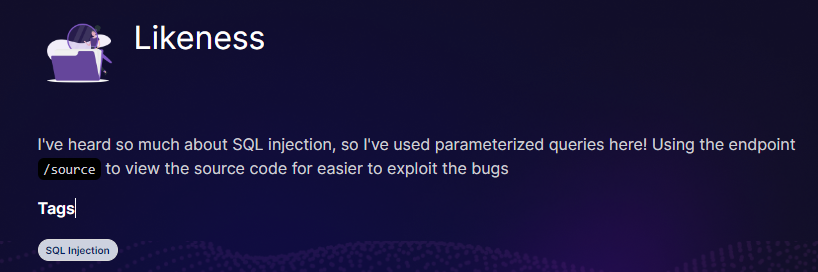
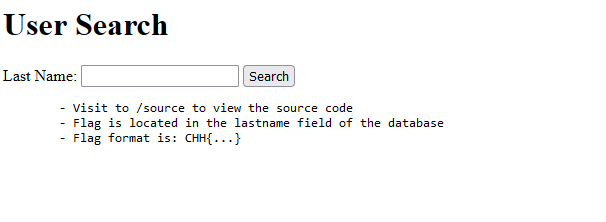
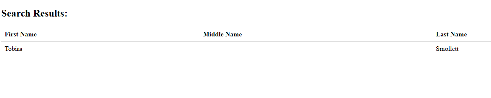
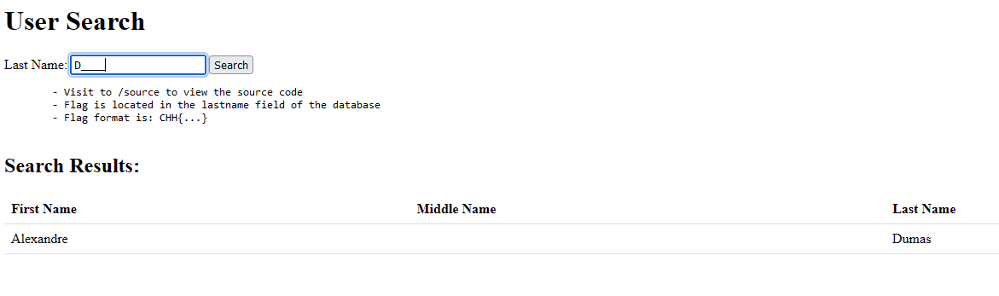
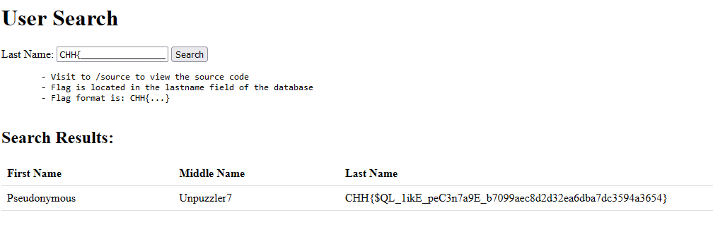

# Likeness



Bài này liên quan tới SQLi như tiêu đề của nó



Bài này cho luôn source nên tiến hành đọc qua thì nôm na là mình chỉ cần nhập vào lastname thì nó sẽ hiện thị ra một bảng




Vì source đã cho sẵn một bảng được tạo

```python
cur.execute('''
        CREATE TABLE authors(first, middle, last)
    ''')
    cur.execute(f'''
        INSERT INTO authors VALUES
            ("Tobias", '', "Smollett"),
            ("William", '', "Shakespeare"),
            ("Edward", "Morgan", "Forster"),
            ("George", "", "Eliot"),
            ("Louisa", "May", "Alcott"),
            ("Lucy", "Maud", "Montgomery"),
            ("Frank", "T.", "Merill"),
            ("Herman", "", "Melville"),
            ("Alexandre", "", "Dumas"),
            ("Elizabeth", "", "Von Arnim"),
            ("Pseudonymous", "Unpuzzler7", "{open("/flag.txt").read()}")
    ''')

```

Tuy nhiên bài này cũng không thể xử lý theo kiểu error_base, union_base, blind được vì đoạn code đã được xử lý an toàn

```python
res = cur.execute("SELECT * from authors where last LIKE ?",
                          (request.args['lastname'].replace("%", ""),))

```

Sau một hồi mò mẫn thì mình thấy có một lỗi xuất hiện là SQLi via underscore



Nhìn vào đây thì ta cũng hiểu nó xảy như nào, tức là dấu _ hoàn toàn hợp lệ trong câu truy vấn này. Chỉ cẩn 1 kí tự đúng trong chuỗi và các dấu _ hợp lại bằng đúng length của chuỗi có trong cột lastname thì nó sẽ là đúng.


Vì vậy ở đây mình sẽ thử sử dụng nhiều dấu _ để tìm flag, vì flag=CHH{... Vì vậy mình sẽ thử cho đến khi vừa với kích thước của flag là được



Bài này chú ý nếu viết script để khai thác là vì có litmit 5 giây/request

```
@app.route('/', methods=["GET"])
@limiter.limit("5/second")
```

Flag: CHH{$QL_1ikE_peC3n7a9E_b7099aec8d2d32ea6dba7dc3594a3654}