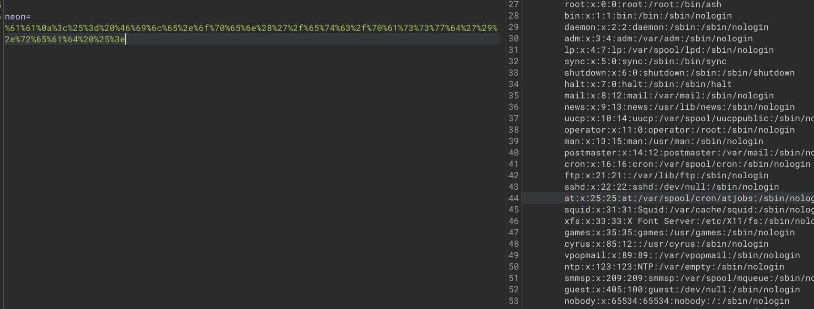

# Neonify

Bài này là một dạng ssti theo như tag của bài cho và nó liên quan đến thư viện ERB của ruby

Mình bắt đầu đầu thử mẫu và bị filter nặng nề :(, Bài này nó chỉ chấp nhận a-zA-Z0-9 ngoài cái này thì không được

Và mình bắt đầu loay hoay tìm cách bypass, và tham khảo được một số cách

Đó là trong ruby thì filter này chỉ áp dụng cho đầu chuỗi đến cuối chuỗi, và nếu chúng ta cho thêm một kí tự xuống dòng \n thì sẽ bypass thành công

Do vậy payload:

RCE thành công

Flag: CHH{Ne0niFY_5s7i_erB_f9a116fc7f78aab700d2c038229afe3c}