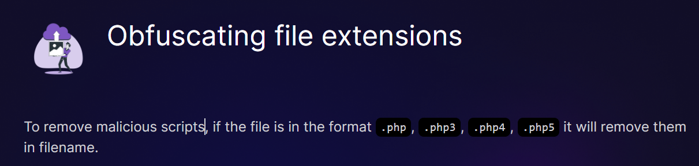
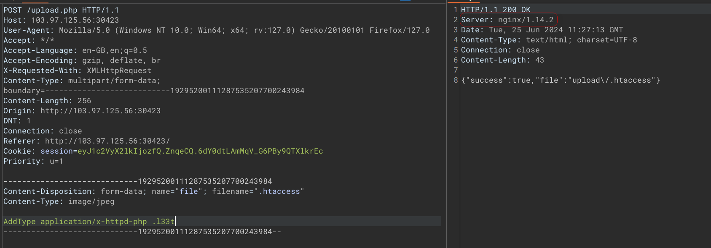
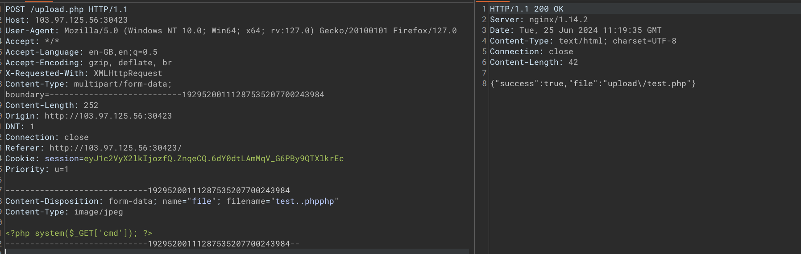

# Obfuscating file extensions
Link: https://battle.cookiearena.org/challenges/web/obfuscating-file-extensions

Bài này liên quan tới upload file và bị filter bởi các đuôi .php, .php3 ...

Mình bắt đầu tiến hành test thử challenge

Lúc đầu mình sử dụng .htaccess để xem sao nhưng không hoạt động vì bài này sử dụng server ngnix, mà .htaccess của apache -> bỏ

Sau một hồi tìm cách filter thì mình bỗng dưng thử được cách đúng

Chương trình xoá .php bằng cách phân tích đuôi và xem nếu là .php thì remove

Và thế là chúng ta RCE được

Flag: CHH{obFusc@7IN6_Fi13_eXtEns10ns_cffe37525ae4937e7a8254c967fa795b}