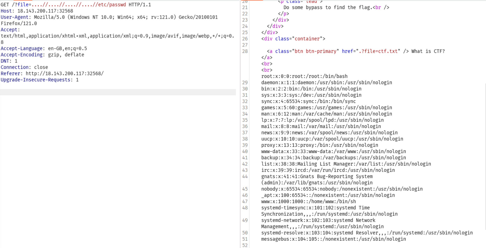

## PHP Inclusion to RCE
Link challenge: https://battle.cookiearena.org/challenges/web/php-inclusion-to-rce

Như tiêu đề thì đây là LFI và mình phải tìm cách RCE chứ không phải một phát ăn luôn

Trong source thì flag ở root nhưng tên file flag đã được thêm mắm muối không thể đoán, mình fuzz thử xem thế nào. Nhưng trước khi fuzz thì mình search xem có cách nào để RCE không thì tìm được được kĩ thuật `LFI to RCE via log Poisoning` có nghĩ là mình sẽ phải tìm xem log của dịch vụ nào có thể đọc và ghi được không.

Vì webserver là Ngix nên mình thử một số payload:

ở đây nó filter ../->'' nên mình dùng payload trên

Giờ mình cần tạo ra lỗi khi request

Phải send 2 lần mới nhìn thấy, và rồi lấy flag thôi

