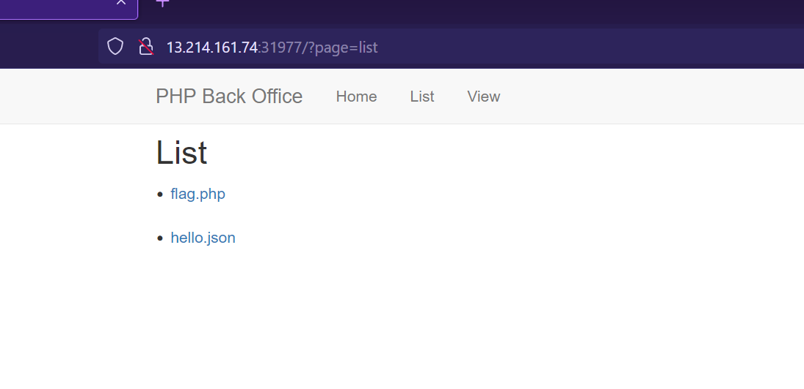
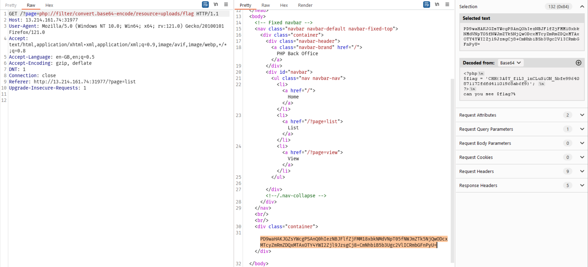

## PHP Inclusion
Link challenge: https://battle.cookiearena.org/challenges/web/php-inclusion

Đề cho là php inclusion, cứ vậy mà exploit thôi

Đặc điểm như này nghĩ ngayy tới php wrapper, và mình thử các payload kiếm trên hacktrick. Sau một hồi thử thì mình kiếm được payload:

payload sử dụng php://filler để inclule file flag(vì trong source mình đã biết vị trí của flag) và chuyển nội dung sang dạng base64

Source bịp =)) thường trong các bài ctf sẽ phải thử hết các trường hợp mà tên file flag được đặt, flag, flag.txt, flag.php...