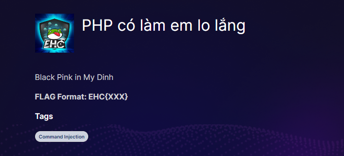
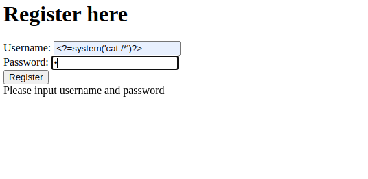
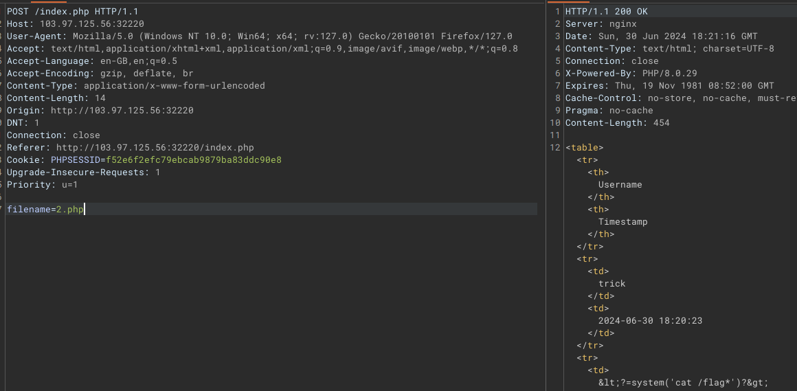
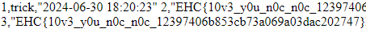

# PHP có làm em lo lắng

Bài này khá hay liên quan tới cmli

Ban đầu mình cũng không biết cmli được injec vào đâu khi mò một lúc thì mình thấy có thể thay đổi được tên file được lưu

Vì dữ liệuc được chuyển sang .csv 1,user,date ...

Trong đó dữ liệu có lưu user và hiện thị ra ngoài, vì vậy mình có thể đổi thên file thành .php vào chèn shell vào username lúc đăng kí, hơn nữa server là nginx nên mình cũng khá chắc cách này là được

Sau đó mình đổi tên file 

