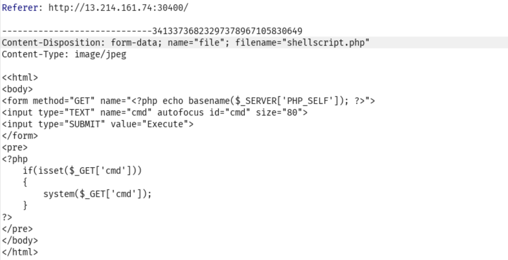

Link challenges: https://battle.cookiearena.org/challenges/web/upload-file-path-traversal

Nhìn qua thì đoán chắc đây là upload file và cần phải upload shell

Payload lúc đầu mình upload một shell nhưng với đuôi là .jpeg sau đó intercep để sửa thành .php

Nhưng sau đó thì truy cập tới file vừa gửi lên thì gặp 403, mình đoán là đề cố tình không cho truy cập vào upload. Vậy thì cách đơn giản là lưu file shell.php ở chỗ khác bằng cách:

Ở đây mình đã sửa `filename=../shellscript.php` để lưu shell cùng với thư mục với chứ upload và thế là được. Và ở đây shell mình đã thay đổi để đọc flag cho nhanh.

