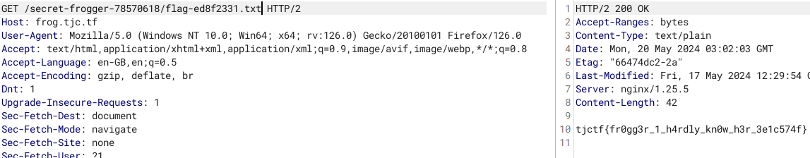

# Tìm thư mục ẩn

Nhìn vào đề thì ta thấy không có thông tin gì ngoài prog...

Mình đoán sẽ phải tìm thư mục nào đó, và tất nhiên sẽ là /robots.txt

```
GET /robots.txt HTTP/2
HTTP/2 200 OK
Accept-Ranges: bytes
Content-Type: text/plain
Date: Mon, 20 May 2024 02:54:17 GMT
Etag: "66474dc2-32"
Last-Modified: Fri, 17 May 2024 12:29:54 GMT
Server: nginx/1.25.5
Content-Length: 50

User-agent: *
Disallow: /secret-frogger-78570618/
```
 
# GET flag
Khi truy cập vào đường dẫn thì mình lại không thấy flag đâu wtf ..., vào source xem 
```
    🐸🐸🐸🐸🐸🐸🐸🐸🐸🐸🐸🐸🐸🐸🐸🐸🐸🐸🐸
    🐸🐸🐸🐸🐸🐸🐸🐸🐸🐸🐸🐸🐸🐸🐸🐸🐸🐸🐸
    🐸🐸🐸🐸🐸🐸🐸🐸🐸🐸🐸🐸🐸🐸🐸🐸🐸🐸🐸
    🐸🐸🐸🐸🐸🐸🐸🐸🐸🐸🐸🐸🐸🐸🐸🐸🐸🐸🐸
    <a href="flag-ed8f2331.txt" style="text-decoration: none;">🐸</a>🐸🐸🐸🐸🐸🐸🐸🐸
    🐸🐸🐸🐸🐸🐸🐸🐸🐸🐸🐸🐸🐸🐸🐸🐸🐸🐸🐸
    🐸🐸🐸🐸🐸🐸🐸🐸🐸🐸🐸🐸🐸🐸🐸🐸🐸🐸🐸
    🐸🐸🐸🐸🐸🐸🐸🐸🐸🐸🐸🐸🐸🐸🐸🐸🐸🐸🐸
```

