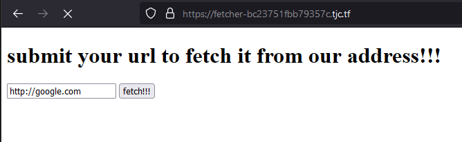
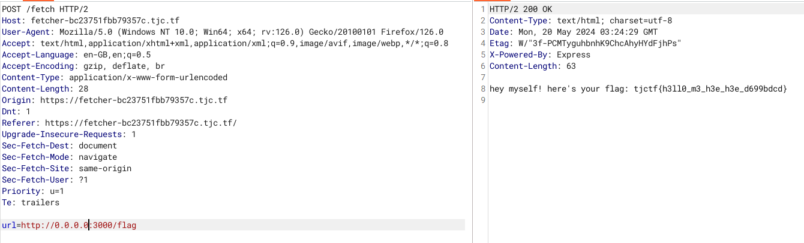

# Phân tích đề

Bài này yêu cầu chúng ta nhập vào form một cái gì đó, nhưng nó bị delay
# Phân tích source

```js
app.post('/fetch', async (req, res) => {
    const url = req.body.url;

    if (!/^https?:\/\//.test(url))
        return res.send('invalid url');

    try {
        const checkURL = new URL(url);

        if (checkURL.host.includes('localhost') || checkURL.host.includes('127.0.0.1'))
            return res.send('invalid url');
    } catch (e) {
        return res.send('invalid url');
    }

    const r = await fetch(url, { redirect: 'manual' });

    const fetched = await r.text();

    res.send(fetched);
});
```

Đoạn code này xử lý dữ liệu chúng ta nhập vào

Nó trả về invalid url khi:
- url có https
- url chưa localhost, 127.0.0.1

```js
app.get('/flag', (req, res) => {
    if (req.ip !== '::ffff:127.0.0.1' && req.ip !== '::1' && req.ip !== '127.0.0.1')
        return res.send('bad ip');

    res.send(`hey myself! here's your flag: ${flag}`);
});
```

Đoạn này thì nếu /flag và ip khác với cái ip trong if thì sẽ trả về flag

# IP restriction bypassing

