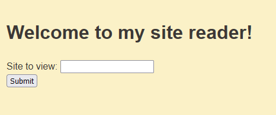

# Phân tích đề
Đề cho ta source, đầu tiên là mình xem chưa năng của bài là gì

Nô na là chúng ta sẽ nhập các đường dẫn vào đây và sau đó nó sẽ trả về một trang web với các thẻ được thay đổi tối giản hơn


# Phân tích source

```python
@app.route("/monitor")
def monitor():
    if request.remote_addr in ("localhost", "127.0.0.1"):
        return render_template(
            "admin.html", message=flag, errors="".join(log) or "No recent errors"
        )
    else:
        return render_template("admin.html", message="Unauthorized access", errors="")
```
Chúng ta cần quan tâm đoạn này, nếu ip là localhost hoặc 127.0.0.1 và /monitor thì sẽ đọc flag


Vì sao là cổng 5000 thì xem Dockerfile