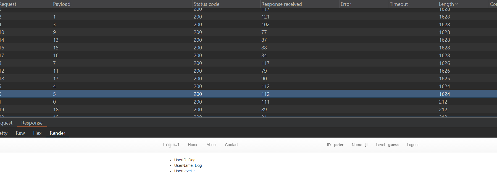
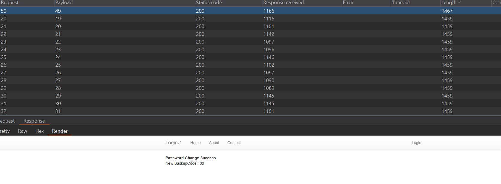
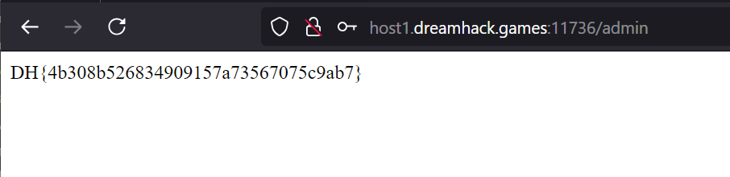

Bug ở đây nằm ở enpoint /forgot_password
```python
userid = request.form.get("userid")
newpassword = request.form.get("newpassword")
backupCode = request.form.get("backupCode", type=int)
```
Khi mà đoạn này chỉ yêu cầu nhập vào userid và backupcode, mà backupcode là một giá trị ngẫu nhiên 0-100
```python
def makeBackupcode():
    return random.randrange(100)
```
Suy ra đoạn này ta có thể đặt lại password của bất kì tài khoản nào.
Nhưng giờ làm thế nào để biết admin
...
```python
@app.route('/user/<int:useridx>')
def users(useridx):
```
Đoạn này đã vô tình leak cho chúng ta các tài khoản tồn tại bằng cách bruteforce

userlevel1 = admin
Nên chúng ta tiến hành brutefoce backupcode với tài khoản này


Và tiến hành đăng nhập tới /admin để lâys flag
