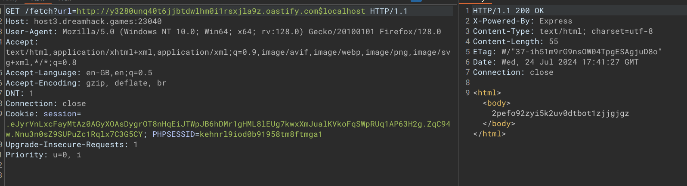
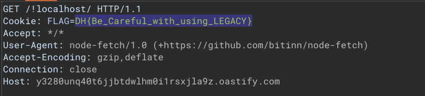

```js
if (host !== "localhost" && !host.endsWith("localhost"))
```
Đoạn so sánh này có nghĩa là biết host khác localhost và điểm kết thúc của url là là localhost, chúng ta chỉ cần bypass điều kiện thứ 2. 
Ở đây đơn giản là chỉ cần thêm một kí tự đặc biệt vào như !,$ để ngăn url được phân tách
